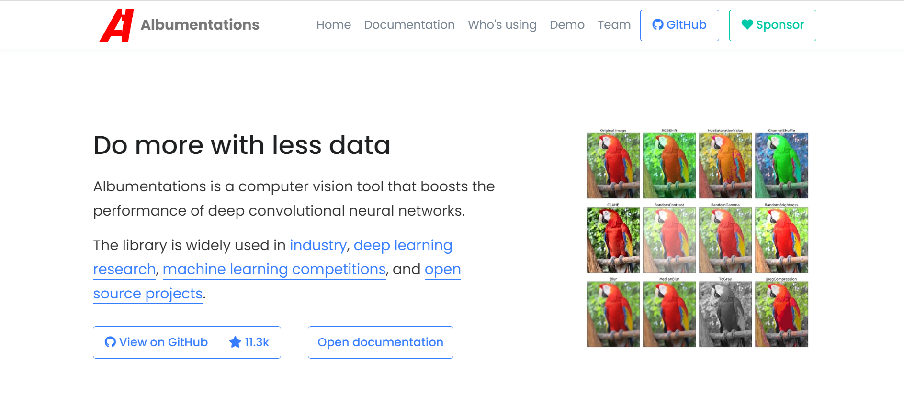

### Install environment

``` shell
 pip install -r requirements.txt
```

### Data Preprocessing
Result already store at Google Cloud

Step
1. Unzip Training Dataset_v5.zip
2. Separate images and labels
3. Resize and Unsharp images
4. Convert the labels into demanded yolo form
5. Separate training data and validation data
 
 Use Albumentation to resize and unsharp images. It is a python library for flexible image augmentations, with performing over 70 image transform operations.<br>
 <div align="center">
    <a href="./">
        
    </a>
</div>

Run [Data_Preprocessing.ipynb](https://github.com/yumixxxx/Tbrain/blob/main/Data_Preprocessing.ipynb "Title")

### Detection
* Run [Execution.ipynb](https://github.com/yumixxxx/Tbrain/blob/main/run.ipynb "Title")
* For example:
 ``` shell
 !python detect.py --weights 'weights/yolov7-e6e_best.pt' --img-size 1280 --source 'custom_data/private_test' --save-txt --name 'private_test_detect' --augment --conf-thres 0.3 --iou-thres 0.4
 ```
 After detection, the predict label is represented by six values `[class, x_center_norm, y_center_norm, width_norm, height_norm, confidence]`, where x_center, y_center, width and height are the normalized coordinates of the center of the bounding box.
 
Results are saved at Google Cloud [detection](https://drive.google.com/drive/folders/1tMzYBX8-s5xbdCj2s7YlJEoP64jrQ_rv?usp=sharing "Title")
 
### Training
* Train your custom data
* Run [Execution.ipynb](https://github.com/yumixxxx/Tbrain/blob/main/run.ipynb "Title")
* Weights can be downloaded at [weight](https://drive.google.com/drive/folders/12qsqxV4p6yIXG5ov_XXaGYEdnPVKiGun?usp=sharing"Title")
  * yolov7-e6e(pre-trained model)
  * yolov7-e6e_best(final model)
* For example:
``` shell
!python train_aux.py --batch-size 8 --data 'data/custom_data.yaml' --epochs 20 --img 1280 1280 --cfg 'cfg/yolov7-e6e.yaml' --weights 'weights/yolov7-e6e_best.pt' --hyp 'data/hyp.scratch.p6.yaml'
```

### Convert labels
Convert the labels into demanded form, `[class, x_center, y_center, width, height, confidence]` to `[class, x_min, y_min, width, height]`, where x_min and y_min are coordinates of the top-left corner of the bounding box

can refer to restore _label.ipynb
